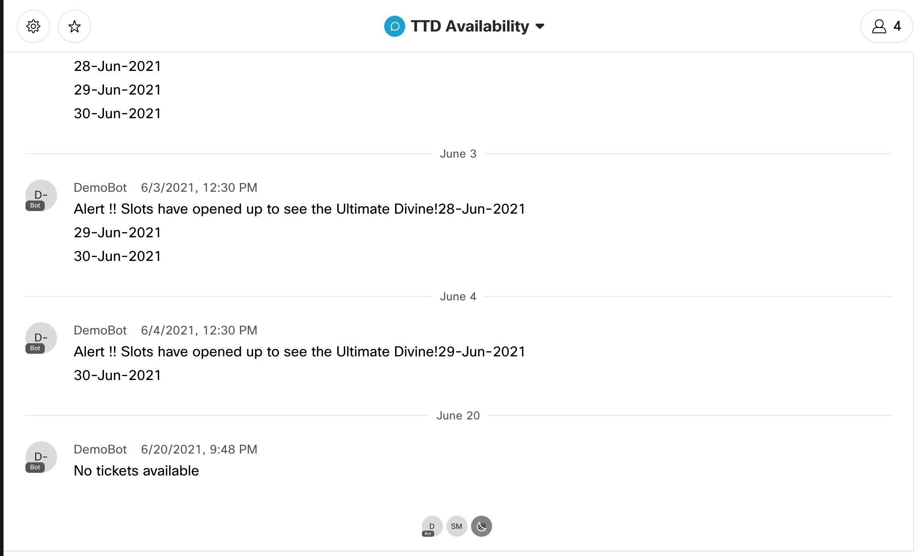

### Features
- Tirumala Tirupathi Devasthanam is a piligrimage place for Hindus in India. Over 300K devotees visit the temple everyday.
- The tickets for various sevas are always in demand. 
- This suite of scripts aim to notify the tickets for various sevas like 300Rupees Darshan,ArjithaBrahmostavam, Vasantotsavam,Kalyanotsavam and Vishesha Pooja.
- Notification destinations can be either Telegram or Webex .
- This code can be used to run in your servers to ping the seva tickets availability as per the frequency of your choice by setting cronjobs.

## Telegram Bot 
### Create Telegram Bot
Unlike Whatsapp Bot, Telegram Bots are free to use. Telegram Bot are widely used by several developers to build applications. First you need to have a Telegram Account and bot can be registered by following the [link](https://sendpulse.com/knowledge-base/chatbot/create-telegram-chatbot)

### Copy the Telegram Token
Copy the Telegram Access Token in to a credentials file. The telegram access token looks like this
```
[telegram]
accessToken = 1891112227:AAHdsasd&askjlasMIya6ppKGu9lAKluiMtkwdSsiZdx_f0
```

## Webex Bot 
### Create Webex Bot
Webex Bots are widely used by several developers to build applications on Webex. First you need to have a Cisco Webex Account and bot can be registered by following the [link](https://developer.webex.com/docs/bots)

### Copy the Webex Bot Token
Copy the Webex Bot Access Token in to a credentials file. The telegram access token looks like this
```
[webex]
webexaccessToken = mIzMS00YjcxLWFmNzMtNDVkjNWFlMTMwYjctMWJk_PF84_a3749315-ae09-4a52-806c-2c3222fa7c2c
```

### Export the Location of creds File into environment variable
To avoid access tokens being shared, I follow this apporach of having the path to credentials file stored in a environment variable
```
export DevKeys=/Users/Achuth/Keys/cred
```

### Get the Chat Id of the Telegram Space
Get the chat Id of the space you want to ping the notifications to and copy the chat id to the chatIds dictionary.
```
ChatIds= {
    "GiddyUp":"-1001428866192"
}
```

### Get the Room Name of the Webex
Get the room name of the webex teams space where the bot is added. In my example my room title is TTD Availability. You can replace by your room name.
```
for room in all_rooms:
    if room.title == 'TTD Availability':
        roomId = room.id
```

## Installations and Dependencies
```
$ pip3 install -r requirements.txt
```

## How to run the Script for Telegram Notifications?
```
$ python3 ttd_telegram.py
```
## How to run the Script for Webex Notifications?
```
$ python3 ttd_webex.py
```

## Output
